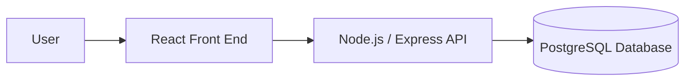

#  A.I.M. — Action, Intention, Momentum

A.I.M. is a modern, Kanban-style task manager designed to help me turn personal goals and everyday responsibilities into manageable actions, maintain focus, and make consistent progress toward completion.

**Author:** Tosh · **Course:** CMP 464/343 Product 1 · **Last updated:** October 4, 2026

---

## 1. About Me (the User)

I am a student, developer, and individual striving to accomplish personal and professional goals while balancing the everyday responsibilities of life. Living with ADD adds another layer of difficulty to managing competing responsibilities, maintaining focus, and following through on plans.

As responsibilities continue to build, important tasks and ideas often get lost in a mental backlog of things I need to do. Although I have the motivation to make progress, turning my intentions into consistent action can be challenging.

I often find myself planning more than I accomplish. I may set expectations for what I want to complete in a day, but struggle to follow through on those expectations.

**The last 3 times this happened:**
1. Academic responsibilities: I intend to complete multiple assignments and coursework tasks before the weekend while balancing other responsibilities. However, I focused on only one or two tasks, leaving the remaining work unfinished and increasing the pressure as deadlines approached.

2. Personal responsibilities: Outside of school, I set several personal goals but struggled to determine which ones to prioritize. As I attempted to keep track of everything mentally, I often delayed taking action, making it difficult to maintain consistent progress.

3. Project development: Outside of school, I set several personal goals but struggled to determine which ones to prioritize. As I attempted to keep track of everything mentally, I often delayed taking action, making it difficult to maintain consistent progress.

**What it costs me:**
- ⏱️ Time: Hours spent deciding what to do, reorganizing responsibilities, or postponing tasks instead of completing them.

- 💸 Money: Potential lost income or delayed financial progress when responsibilities and opportunities are not completed on time.

- 🔋 Energy: Mental fatigue from keeping unfinished responsibilities in my head and feeling overwhelmed by competing expectations.

- 🙂 Joy: Frustration from not accomplishing what I planned, reduced satisfaction with my progress, and less time available for personal interests.

---

## 2. Problem Statement

**Gut check:**

I need a consistent way to turn my goals and responsibilities into manageable actions because knowing what needs to be done does not always translate into actually doing it without burning out.

**Five Whys:**
1. Why? I often feel overwhelmed by the number of tasks I have to complete.
2. Why? I struggle to prioritize my tasks effectively.
3. Why? I have difficulty breaking down larger goals into smaller, actionable steps.
4. Why? I tend to focus on immediate tasks and neglect long-term goals.
5. Why? I lack a structured approach to managing my time and responsibilities.

**Problem statement:**

When I have something I need to do, whether it is a personal goal, an assignment, a chore, or another responsibility, I often have difficulty turning that intention into consistent action.

As more responsibilities are added to my plate, it becomes harder to determine what I should focus on and when I should do it. Instead of making steady progress, I can end up procrastinating, forgetting important tasks, or completing only a small portion of what I originally planned. Over time, this can result in wasted time, lost income, and delayed personal development.

The problem is not necessarily knowing that something needs to be done. The problem is turning a collection of responsibilities and expectations into consistent, manageable action.

**I'll know this is solved when:** 
I can consistently turn responsibilities and personal goals into manageable steps, understand what needs my attention, and make visible progress toward completion instead of allowing important tasks to remain indefinitely unfinished.

---

## 3. Existing Solutions

| What I use or tried | What it does well | Why it falls short *for me* |
|---|---|---|
|**Whiteboard**| Gives a clear visual reminder of responsibilities; easy to update; helps externalize tasks.| Seeing tasks doesn’t reliably trigger action; doesn’t help with choosing what to focus on; doesn’t support realistic time expectations.|
|**Trello**|Organizes tasks into neat lists; good for categorizing responsibilities; keeps everything in one place.|A list alone doesn’t solve the “what should I do right now?” problem; doesn’t help with follow‑through; doesn’t help calibrate expectations or prevent overwhelm.|
|**Mental reminders**|Helps me remember something I consider important|Relies heavily on memory and can fail when I become focused on something else|

**The gap:**

There is a significant gap between understanding what matters and taking consistent action toward it. What is missing for me is a clear connection between what I want to accomplish, what I need to do next, what I have already accomplished, and the expectations I set for myself.

---

## 4. Features & Benefits

*Every feature should move me toward my "solved when" line.*

| Feature (what it does) | Benefit (how my life gets better) | MVP or Later? |
|---|---|---|
| **Goal Creation** — Create and define a goal or project with a title and description.| Gives me a clear destination and helps turn vague intentions into something actionable.| MVP|
| **Task Breakdown** — Create smaller steps or tasks associated with a goal, including descriptions and due dates. | Makes large responsibilities feel manageable and reduces the tendency to procrastinate because I don't know where to start.| MVP|
| **Agile Workflow** — Organize tasks into Ready, In Progress, Review, and Done stages using a Kanban board.| Gives me a visual understanding of what needs attention, what I'm currently working on, and what I've accomplished. | MVP|
| **Priority Management** — Assign priority levels to tasks.| Helps me distinguish what is important from what can wait, reducing the feeling of being overwhelmed by competing responsibilities.| Later|
| **Progress Dashboard** — Display an overview of goals, completed tasks, pending work, and upcoming deadlines.| Helps me evaluate my progress, recognize accomplishments, and identify where I need to refocus. | Later |
| **Task Labels** — Categorize tasks by responsibility, subject, or type of work.| Helps me organize different areas of life and quickly understand what kind of work needs attention. | Later|

### MVP (2–3 features)

*The skateboard: the smallest version I'd actually use.*

* **Create a Goal:** Establish a goal or project with a title and description.
* **Break It Down:** Create actionable tasks or steps associated with a goal.
* **Manage Workflow:** Move tasks through a simple Kanban workflow: Ready → In Progress → Review → Done.

### Later

*Improvements that can wait until the core experience works.*

* Dashboard with progress summaries.
* Task priorities.
* Labels and categorization.
* Due dates and deadline visibility.
* Editing and deleting goals and tasks.
* Progress statistics and completion summaries.
* Improved project organization.

### Not Doing

*Things I'm deliberately leaving out of the initial scope.*

* Real-time collaboration and team management.
* AI-generated task recommendations or planning.
* Email, SMS, or push notifications.
* Complex reporting and analytics.
* Advanced permission and role management.
* Calendar integrations.
* Time tracking and productivity scoring.
* Mobile application development.

---

## 5. Tech Stack

### Front end
- **Surface:** Web app (desktop and mobile-friendly) with a Kanban-style interface.
- **Tools:** HTML, CSS, JavaScript, React, and a UI framework like Material-UI or Tailwind CSS.
- **Why:** A web application provides an accessible environment for managing responsibilities from my computer without requiring a separate mobile application. React supports reusable components and a structured interface for goals, tasks, and Kanban workflows.

### Back end
| Piece | Choice | Why |
|---|---|---|
| Server / API |  Node.js / Python ?? | TBD |
| Data storage | MongoDB or PostgreSQL ?? | TBD |
| Outside services (optional) |TBD| |
| Hosting / deploy | TBD |  |

### Architecture sketch

---

## 6. Open Questions

*What am I still unsure about? What do I need to figure out or test first?*

- Will breaking responsibilities into smaller tasks make it easier for me to begin working instead of procrastinating?
- What is the minimum information a task needs to be actionable without making task creation feel like additional work?
- Should due dates be included in the initial MVP, or can the basic Kanban workflow provide enough initial value?
- How can A.I.M. help me identify the next task to work on without creating additional complexity?
- What is the most appropriate way to retain goals and task progress between sessions?
- How can I determine whether A.I.M. improves follow-through rather than simply providing another place to organize unfinished responsibilities?
- Can the core experience be completed and deployed within the project timeline?

*What I Need to Test First*
- Whether the goal-to-task workflow is simple enough to use consistently.
- Whether the Kanban board makes it easier to identify the next actionable task.
- Whether the initial feature set is achievable within the project timeline.
- Whether the implemented workflow addresses the original problem rather than simply recreating a digital whiteboard.
- Whether the application reliably saves and retrieves goals and task progress.
